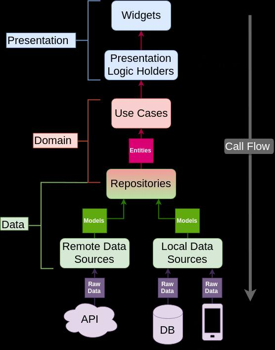

# Flutter GetX Clean Architecture

This repository demonstrates a Flutter application using the GetX state management package following the principles of Clean Architecture. It showcases how to structure a scalable and maintainable Flutter application.
 <!-- Update the path according to your image location -->

## 🚀 Features

- **GetX State Management**: Efficient state management with reactive programming.
- **Clean Architecture**: Separation of concerns with layers for presentation, domain, and data.
- **Dependency Injection**: Service Locator pattern using `GetIt` for dependency management.
- **Responsive UI**: Adaptive UI components to enhance user experience across devices.
- **API Integration**: Handling remote data with clear separation of business logic and presentation.

## 🛠️ Technologies & Libraries Used

- **Flutter**: UI toolkit for building natively compiled applications.
- **GetX**: State management, dependency injection, and routing.
- **Dio**: Powerful HTTP client for Dart for API requests.
- **Freezed**: Code generation for immutable classes.
- **Json Serializable**: For converting JSON to Dart objects and vice versa.
- **GetIt**: Service Locator for dependency management.
- **Carousel Slider**: For implementing carousel functionality.
- **Sliding Drawer**: Custom sliding drawer component.

## 🏗️ Project Structure

This project is organized according to Clean Architecture principles with a focus on separation of concerns:


### Layer Descriptions

1. **Presentation Layer**: Contains UI elements and GetX controllers for managing state and user interactions.
2. **Domain Layer**: Houses business logic with entities and use cases that define the app's core functionalities.
3. **Data Layer**: Responsible for data sources, repositories, and models to interact with APIs or local storage.

## 🔧 Getting Started

### Prerequisites

- [Flutter SDK](https://flutter.dev/docs/get-started/install)
- Dart SDK (comes with Flutter)
- Any IDE (e.g., Android Studio, VS Code)

### Installation

1. **Clone the repository**

   ```bash
   git clone https://github.com/emdiya/getx_clean_architecture
   cd getx_clean_architecture
2. **Install dependencies**
   ```bash
   flutter pub get
   flutter run

